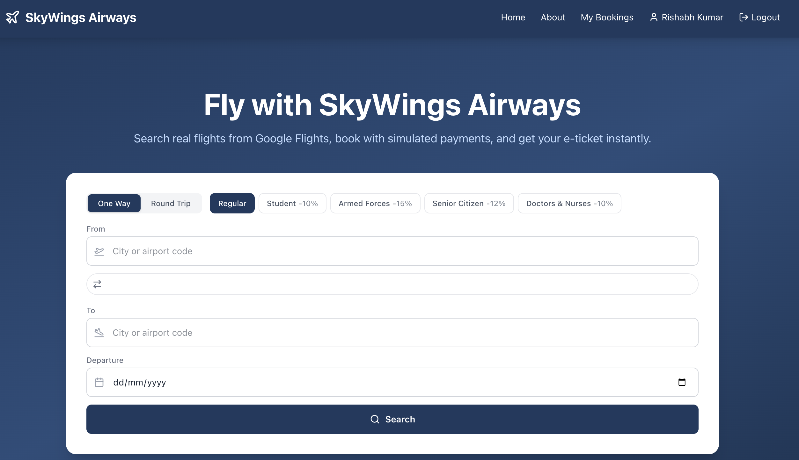
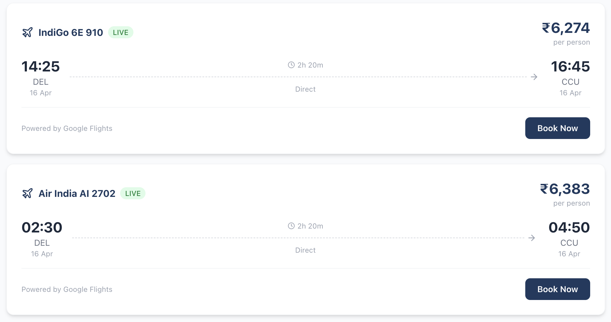
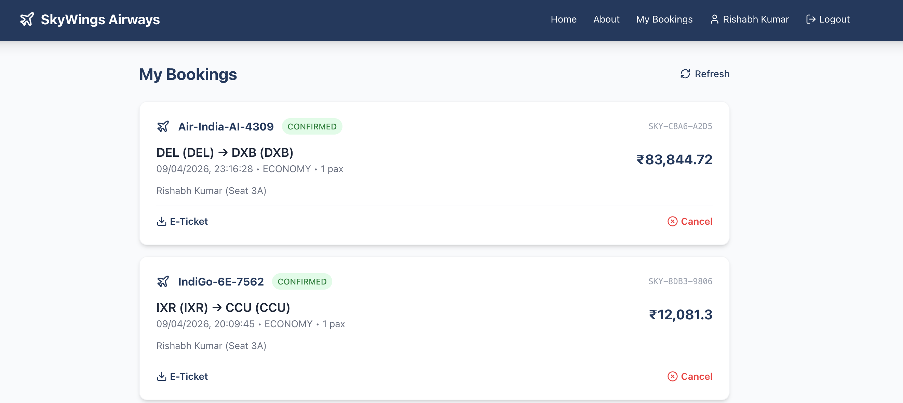
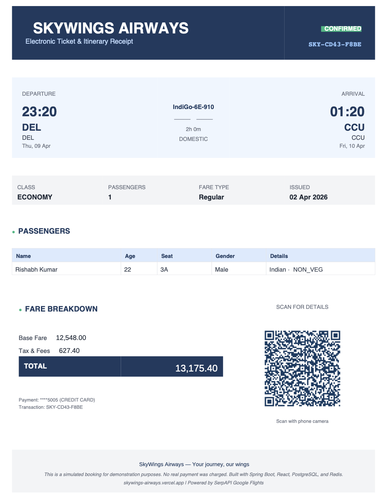

# ✈ SkyWings Airways

<div align="center">


**A full-stack airline ticket booking system with real-time Google Flights data, simulated payments with dual-channel OTP, and PDF e-ticket generation.**

[Live App](https://skywings-airways.vercel.app) &bull; [API Docs (Swagger)](http://150.136.157.197:8080/swagger-ui.html) &bull; [Report Bug](https://github.com/Rishabhmannu/skywings-airways/issues)

</div>

> Originally built as a 3rd semester OOP coursework project (Java Swing), now completely rewritten into a production-grade full-stack application.

---

## Screenshots

<table>
  <tr>
    <td><br/><em>Landing Page — Flight Search with Autocomplete</em></td>
    <td><br/><em>Real-time Flight Results from Google Flights</em></td>
  </tr>
  <tr>
    <td><br/><em>Booking Management — View, Cancel, Download</em></td>
    <td><br/><em>Branded PDF E-Ticket with QR Code</em></td>
  </tr>
</table>

---

## Tech Stack

### Backend


### Frontend


### Integrations
-4285F4?style=flat-square&logo=google&logoColor=white)


### Deployment


### Testing


---

## Deployment

The application is deployed across multiple cloud services — all on **free tiers ($0/month)**:

```
                    ┌──────────────────────────────┐
                    │     skywings-airways.         │
    Users ────────▶ │       vercel.app              │ (React SPA)
                    │     Vercel (CDN)              │
                    └──────────┬───────────────────┘
                               │ /api/* proxy
                               ▼
                    ┌──────────────────────────────┐
                    │  Oracle Cloud VM             │
                    │  150.136.157.197:8080         │ (Spring Boot)
                    │  Always Free ARM/AMD          │
                    │  Ubuntu 22.04 + Java 21       │
                    └──────┬──────────┬────────────┘
                           │          │
                ┌──────────▼──┐  ┌────▼──────────┐
                │ Neon        │  │ SendGrid      │
                │ PostgreSQL  │  │ Email OTP     │
                │ (Free tier) │  │ (100/day)     │
                └─────────────┘  └───────────────┘
                                 ┌───────────────┐
                                 │ Twilio        │
                                 │ SMS OTP       │
                                 │ (Trial)       │
                                 └───────────────┘
                                 ┌───────────────┐
                                 │ SerpAPI       │
                                 │ Google Flights│
                                 │ (100/month)   │
                                 └───────────────┘
```

| Service | Provider | Tier | Purpose |
|---------|----------|------|---------|
| **Frontend** |  | Free | React SPA hosting, global CDN, API proxy |
| **Backend** |  | Always Free | Spring Boot on Ubuntu VM, 24/7 uptime |
| **Database** |  | Free (0.5 GB) | PostgreSQL 17, serverless, auto-suspend |
| **Email** |  | Free (100/day) | OTP emails, booking confirmations |
| **SMS** |  | Trial credit | SMS OTP for payment verification |
| **Flights** |  | Free (100/mo) | Real-time Google Flights data |

---

## Features

- **Real-time flight search** — Live data from Google Flights via SerpAPI with 7,913+ airport autocomplete
- **Visual seat map** — Interactive seat picker with 2-3-2 cabin layout
- **User authentication** — JWT auth with email verification OTP on signup
- **Multi-step booking** — Class selection, passenger details (gender, DOB, meal preference, accessibility needs), fare discounts
- **Simulated payment** — Luhn card validation + dual-channel OTP (SMS via Twilio + Email via SendGrid). No real money charged.
- **E-tickets** — Branded PDF with QR code (scannable booking details), emailed automatically on confirmation
- **Special fares** — Student (10% off), Armed Forces (15%), Senior Citizen (12%), Doctors & Nurses (10%)
- **Round trip support** — One-way and round-trip flight search
- **Admin dashboard** — Flight CRUD, booking management with passenger details, user role management, revenue stats
- **Booking management** — View history, cancel with 25% penalty, download tickets
- **Input validation** — Server-side validation on all endpoints, XSS sanitization, password strength enforcement
- **Error handling** — Global exception handler, structured API error responses, 404 page

---

## Quick Start (Local Development)

### Prerequisites

- Java 21 (Eclipse Temurin)
- Maven 3.9+
- Node.js 20+
- Docker Desktop

### 1. Clone & configure

```bash
git clone https://github.com/Rishabhmannu/skywings-airways.git
cd skywings-airways
cp .env.example .env
# Edit .env with your API keys (SendGrid, Twilio, SerpAPI)
```

### 2. Start everything

```bash
./start.sh
```

This starts PostgreSQL + Redis (Docker), the Spring Boot backend, and the React frontend. Runs health checks on all 5 services.

### 3. Open the app

| Service | URL |
|---------|-----|
| App | http://localhost:5173 |
| API | http://localhost:8080 |
| Swagger | http://localhost:8080/swagger-ui.html |

### 4. Shut down

```bash
./shutdown.sh
```

---

## Test Accounts

| Role | Email | Password |
|------|-------|----------|
| Admin | admin@skywings.com | Admin@123 |
| Passenger | Sign up from the UI | — |

## Test Card Numbers

| Card | Number | Luhn Valid |
|------|--------|-----------|
| Visa (test) | 4532 0151 1283 0366 | Yes |
| Visa (common) | 4111 1111 1111 1111 | Yes |
| Invalid | 1234 5678 9012 3456 | No |

Use any future expiry (e.g., 12/28) and any 3-digit CVV.

---

## API Keys Setup

| Service | Free Tier | Get Keys |
|---------|-----------|----------|
|  | 100 emails/day | [sendgrid.com](https://sendgrid.com) — Use Single Sender Verification |
|  | ~1,900 SMS with trial credit | [twilio.com](https://twilio.com) — Add Verified Caller IDs for trial |
|  | 100 searches/month | [serpapi.com](https://serpapi.com) — Google Flights engine |

All services work without API keys configured — the app falls back gracefully (email OTP logs to console, flights served from database, SMS skipped).

---

## Project Structure

```
├── backend/                        Spring Boot application
│   ├── src/main/java/com/skywings/
│   │   ├── config/                 Security, Redis, OpenAPI, JWT filter, data seeder
│   │   ├── controller/             REST API endpoints (7 controllers)
│   │   ├── dto/                    Request/Response DTOs (18 classes)
│   │   ├── entity/                 JPA entities + enums (6 entities, 6 enums)
│   │   ├── exception/              Custom exceptions + global handler
│   │   ├── repository/             Spring Data JPA repositories
│   │   ├── service/                Business logic (12 services)
│   │   └── util/                   Luhn validator, input sanitizer, transaction ID generator
│   └── src/test/                   55 tests (unit + controller + integration)
├── frontend/                       React SPA
│   └── src/
│       ├── components/             Reusable UI (seat map, airport search, flight cards)
│       ├── context/                Auth context provider
│       ├── pages/                  16 page components (public + passenger + admin)
│       └── api/                    Axios instance with JWT interceptor
├── screenshots/                    App screenshots
├── docker-compose.yml              PostgreSQL + Redis containers
├── start.sh                        Start all services with health checks
├── shutdown.sh                     Graceful shutdown of all services
├── .env.example                    Environment variable template
└── README.md
```

---

## Running Tests

```bash
cd backend
mvn test
```

55 tests covering: BookingService, PricingService (with fare discounts), AuthService, PaymentService, OtpService, LuhnValidator, AuthController, FlightController, and a full booking flow integration test.

---

## Architecture

```
React SPA ──→ Spring Boot REST API ──→ PostgreSQL (Neon)
   │                │
   │          JWT Auth Filter
   │                │
   │         ┌──────┴──────┐
   │         │   Services  │
   │         ├─────────────┤
   │         │ SerpAPI     │──→ Google Flights (real-time)
   │         │ Twilio      │──→ SMS OTP
   │         │ SendGrid    │──→ Email OTP + confirmations
   │         │ OpenPDF     │──→ Branded PDF e-tickets
   │         │ ZXing       │──→ QR codes (scannable booking data)
   │         │ OtpStore    │──→ In-memory OTP storage (Redis in dev)
   │         └─────────────┘
```

---

## License

Portfolio project by **Rishabh Kumar** ([@Rishabhmannu](https://github.com/Rishabhmannu)).
Built as a complete evolution of a 3rd semester OOP coursework project at **IIIT Allahabad**.

<div align="center">

Built with Claude Code


</div>
